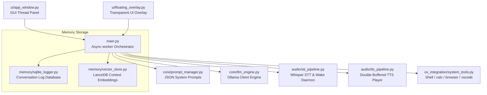
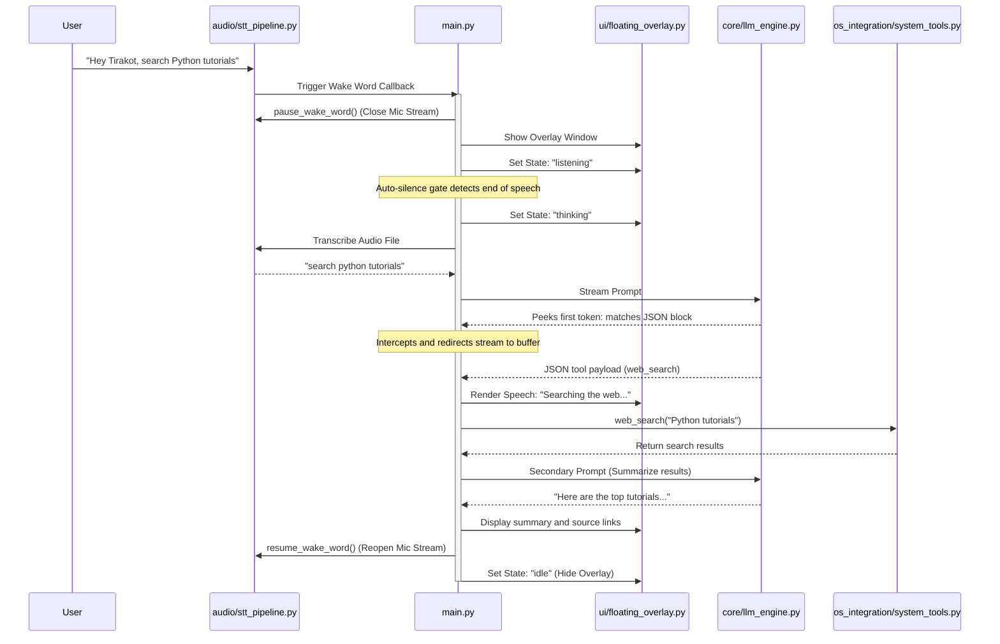

<p align="center">
  
</p>

# Tirakot AI: Task-Integrated Resource-Aware Knowledge & OS Tool 🚀

[](https://www.python.org/)
[](https://www.microsoft.com/windows)
[](https://developer.nvidia.com/cuda-downloads)
[](https://github.com/psf/black)

A highly robust, offline-first local desktop AI assistant designed for Windows to automate operating system tasks, run web queries (Local RAG), and stage communications via a sleek, transparent visual interface.


---

## 📖 1. Project Background

While cloud-based AI assistants (such as Siri, Cortana, or Copilot) offer conversational services, they depend heavily on internet connectivity, pose data privacy risks, and lack native integration with local OS workflows. Standard local LLM interfaces, on the other hand, are often confined to terminal commands or heavy, sandboxed web UIs.

Furthermore, running multiple deep learning models (LLM, speech-to-text, text-to-speech) simultaneously on consumer-grade hardware (such as an RTX 3050 with a 4GB VRAM ceiling) commonly leads to memory conflicts, audio hardware crashes, and sluggish system performance.

### The Solution: Tirakot AI
Tirakot AI introduces a **centralized, resource-aware orchestration layer** that coordinates local deep learning models and system automation tools. By splitting UI operations from asynchronous backend tasks, it delivers neural-grade voice interactions and OS automation while keeping VRAM usage under 1.4GB.

### 🔥 System Components & Task Alignment
Here is exactly how Tirakot's architecture maps to the core capabilities required for a local operating system copilot:

#### 1. Universal OS Automation Toolkit
Managed by `os_integration/system_tools.py`. It bridges natural language commands and the Windows shell:
- **Registry App Launcher**: Scans Windows registries and paths to launch browsers (Brave, Chrome, Firefox, Edge) directly with target URLs.
- **Start Menu Crawler**: Crawls `.lnk` shortcuts to open apps like Discord or Spotify by their common names.
- **File Search Engine**: Runs recursive directory searches using pattern matching (`fnmatch`) and launches files under default system associations.

#### 2. Adaptive Acoustic Wake Word Detector
Implemented inside `audio/stt_pipeline.py`. It enables hands-free operation:
- **Exponential Moving Average (EMA)**: Calibrates background noise levels to prevent Whisper transcription hallucinations during quiet room periods:
  $$\text{background\_rms} = 0.98 \times \text{background\_rms} + 0.02 \times \text{rms}$$
- **VAD Gating**: Gathers consecutive speech frames to ignore short noise spikes (like mouse clicks).
- **Stream Suspension**: Suspends background mic streams when recording active queries to prevent Windows PortAudio hardware access conflicts.

#### 3. Transparent Floating Overlay UI
Designed inside `ui/floating_overlay.py` to display state-dependent wave animations:
- **Visual Waveform Canvas**: Draws four overlapping sine-wave layers pulsing dynamically to indicate system states (Listening, Thinking, Speaking, Idle).
- **Draggable Context Card**: Displays real-time transcriptions and streaming AI responses, with coordinate tracking for custom positioning.

#### 4. Stream Interception & Web RAG Loop
Managed in `main.py`. Peeks at the initial token of the LLM's stream:
- **Silent Action Tools**: Intercepts JSON blocks, runs commands (like opening VS Code), reads vocal confirmations, and returns to background mode.
- **Web RAG**: Runs search queries, appends findings to the prompt context, and executes a secondary prompt to summarize results.

---

## ✨ 2. Key Features

- **🛡️ Zero-Cloud Privacy:** Runs 100% offline. All transcriptions, LLM generations, and database logging are processed locally on your hardware.
- **🔄 PortAudio Safety Controls:** Prevents device collisions by stopping background wake-word streams before active recording sessions claim the microphone, and restarting them afterwards.
- **🩺 Diagnostics & Monitoring:** Real-time console logs display background noise levels, calibration thresholds, and system health status.
- **🎨 Interactive Avatar Bobbing:** The chat UI features a Snapchat-style assistant avatar ([girl\_bitmoji.png](ui/png/girl_bitmoji.png)) that bob-animates and renders canvas waveforms in real-time during active speech.
- **⚙️ Global Hotkey & Tray Access:** Minimize the app to the system tray to run it in the background, and summon the overlay instantly using **Ctrl + Shift + Space**.

---

## 🏗️ 3. Architecture & Modular Block Diagrams

Tirakot separates its core logic into **7 dedicated modules** to prevent circular imports and simplify debugging:



### The Component Layer
1. **`core/prompt_manager.py`**: Formats chat history and structures system prompts, guiding the local LLM to output either JSON tool actions or natural text.
2. **`core/llm_engine.py`**: Connects asynchronously to the local Ollama service, managing generation streams and connection fallbacks.
3. **`audio/stt_pipeline.py`**: Handles microphone input callback queues and runs CUDA-accelerated Whisper model transcriptions.
4. **`audio/tts_pipeline.py`**: Cleans text, downloads neural voice MP3 files, and plays them via the Windows Multimedia Control Interface (`winmm.dll`).
5. **`ui/floating_overlay.py`**: Renders the borderless, transparent Tkinter canvas window and animated wave visuals.
6. **`os_integration/system_tools.py`**: Contains OS-level automation utilities (launching browsers, running shell commands, creating local workspace files).

---

### 📂 File Mappings & Inter-process Communication (Who Sends What to Whom?)

Tirakot relies on structured data structures and asynchronous messaging hooks to coordinate operations across modules. Below is a detailed breakdown of how files interact and what data gets exchanged:

```
[Start_Tirakot.vbs]
        │ (Launches silently)
        ▼
[Start_Tirakot.bat]
        │ (Checks Ollama service, triggers virtual environment)
        ▼
   [main.py] (Host Process)
     ├── Spawns Async loop thread
     ├── Instantiates cmd_queue & gui_queue
     └── Launches GUI thread window
            │
            ├───────► [ui/app_window.py] (GUI Thread)
            │           ├── Listens to keyboard.GlobalHotKeys (Ctrl+Shift+Space) via pynput thread
            │           ├── Runs system tray loop via pystray thread
            │           └── Polls gui_queue every 50ms for events
            │
            ├───────► [audio/stt_pipeline.py] (Wake Daemon)
            │           ├── Runs _wake_loop in background thread, sampling raw mic arrays
            │           └── Sends "wake_by_voice" Command to cmd_queue upon phonetic match
            │
            └───────► [main.py: async_worker] (Worker Thread loop)
                        ├── Receives commands from cmd_queue
                        ├── Shuts down Wake Daemon to prevent PortAudio locks
                        ├── Summons [ui/floating_overlay.py] via gui_queue ("wake_overlay")
                        ├── Saves microphone PCM buffer to WAV file on disk
                        ├── Passes WAV to [audio/stt_pipeline.py] for transcribing
                        ├── Reads text, sends to [core/prompt_manager.py] for history format
                        ├── Feeds messages array to [core/llm_engine.py] (Ollama stream)
                        │
                        ├── [Conversational Path]:
                        │     ├── Feeds stream chunks to [ui/floating_overlay.py] via gui_queue
                        │     └── Enqueues sentence segments to [audio/tts_pipeline.py]
                        │
                        └── [Action Interceptor Path]:
                              ├── Parses JSON action arrays
                              ├── Speaks synthesized confirmation via [audio/tts_pipeline.py]
                              └── Triggers functions inside [os_integration/system_tools.py]
```

#### Detailed Execution Sequence:
1. **Booting Phase**:
   - [Start_Tirakot.vbs](Start_Tirakot.vbs) executes [Start_Tirakot.bat](Start_Tirakot.bat) silently.
   - The batch script starts `ollama.exe` if not running, then runs [main.py](main.py).
   - [main.py](main.py) instantiates `cmd_queue` (GUI to Worker) and `gui_queue` (Worker to GUI) thread-safe FIFO queues.
   - It runs `start_async_loop(cmd_queue, gui_queue)` in a background daemon thread and starts the Tkinter event loop in the main thread by calling `app.mainloop()` on [ui/app_window.py](ui/app_window.py).

2. **Always-Listening Wake Word Monitor**:
   - [audio/stt_pipeline.py](audio/stt_pipeline.py) opens a `sounddevice.InputStream` in a daemon thread executing `_wake_loop()`.
   - It performs Voice Activity Detection (VAD) and noise floor calibration. If the keyword "Hey Tirakot" is matched, it inserts `("wake_by_voice", None)` into the `cmd_queue`.

3. **Hotkey or Voice Summoning**:
   - If the user presses the global hotkey (**Ctrl + Shift + Space**), the `pynput` keyboard thread in [ui/app_window.py](ui/app_window.py) intercept it and inserts `("toggle_mic", None)` into the `cmd_queue`.
   - The worker in [main.py](main.py) fetches the command, stops the wake stream via `stt_pipeline.pause_wake_word()`, and posts `("wake_overlay", None)` to the `gui_queue`.
   - [ui/app_window.py](ui/app_window.py) receives the event, withdraws the main panel, and opens [ui/floating_overlay.py](ui/floating_overlay.py).

4. **Speech Capture & Transcription**:
   - [main.py](main.py) records raw audio using `sounddevice` inside `stt_pipeline.record_until_stopped()`.
   - The audio array is saved as a temporary WAV file under `%TEMP%\tirakot_stt.wav`.
   - [main.py](main.py) triggers `stt_pipeline.transcribe(wav_path)` in a thread pool (`asyncio.to_thread`) running Whisper. It sends the transcribed text to `gui_queue` (displaying it on the overlay context card) and pipes it to the query processor.

5. **Prompt Context & LLM Generation**:
   - [main.py](main.py) fetches local system parameters (local date, weather, news) from [os_integration/system_tools.py](os_integration/system_tools.py).
   - It formats the message prompt with [core/prompt_manager.py](core/prompt_manager.py), which applies text or voice behavior guidelines.
   - It passes the formatted prompt list to [core/llm_engine.py](core/llm_engine.py) to stream responses from the local Ollama Qwen model.

6. **Action Execution**:
   - If a JSON block is peeked, [main.py](main.py) extracts the action command:
     - Opening applications, system tools, or directories calls `tools.execute_system_command()` or `tools.advanced_open()`.
     - VS Code document writing calls `tools.create_vscode_file()`.
     - Searching web queries calls `tools.web_search()` (DuckDuckGo Search) and feeds the output back into the LLM for RAG summarization.
     - Spoken confirmations are sent to [audio/tts_pipeline.py](audio/tts_pipeline.py) for MP3 generation and Win32 MCI playback.

---

### The Dynamic Execution Loop
Here is the sequence of operations that occur when a voice query triggers the assistant:



---

## 🚀 4. Instructions for Execution

### Prerequisites
- **Windows 10 or 11** (64-bit)
- **NVIDIA GPU** (recommended RTX 30-series or higher for CUDA acceleration)
- **Ollama** installed and running on Windows
- **Python 3.10 or 3.11**

### Step 1: Clone and Set Up Environment
**1. Clone the project files locally:**
```bash
git clone <repository-url>
cd "Tirakot AI"
```

**2. Initialize the Python Virtual Environment:**
```bash
python -m venv venv
venv\Scripts\activate
```

**3. Install Dependencies:**
```bash
pip install -r requirements.txt
```

### Step 2: Configure Models & CUDA
**1. Pull the LLM Model in Ollama:**
```bash
ollama pull qwen2.5:3b
```

**2. Configure the central `config.yaml` parameters:**
```yaml
llm_model: "qwen2.5:3b"
stt_model: "base.en"          # Options: tiny.en, base.en, small.en
stt_device: "cuda"            # Set to 'cpu' if NVIDIA GPU is not available
tts_voice: "en-US-AnaNeural"  # Default Microsoft Edge neural voice
enable_cuda: true
```

### Step 3: Run the Application
You can launch Tirakot AI in two modes:

* **Background Mode (Tray Launcher)**: Double-click [Start\_Tirakot.vbs](Start_Tirakot.vbs). This runs [Start\_Tirakot.bat](Start_Tirakot.bat) silently in the background, keeping the assistant minimized in the system tray.
* **Console Debug Mode**: Run the batch script directly from a terminal window:
  ```bash
  Start_Tirakot.bat
  ```

---

## 💻 5. Interface Usage Guide & Workflows

Tirakot runs in the system tray as a background daemon:
* **Summon overlay**: Tap **Ctrl + Shift + Space** globally to bring up the assistant.
* **Hands-free trigger**: Say **"Hey Tirakot"** or **"Tirakot"** to activate the listener.
* **Close / Minimize**: Click the overlay's close button or the panel's close button to return the assistant to the background tray.

### Tool Parameter Schema Mappings
Below are example JSON payloads that the local LLM generates to execute system tools:

```json
// Create local files and launch them in VS Code
{"tool": "create_vscode_file", "parameter": {"filename": "test.py", "code": "print('Hello World')"}, "speech": "Creating test dot py."}

// Search, locate, and open a document recursively
{"tool": "locate_and_open_file", "parameter": {"filename": "Report.docx", "directory_path": "C:\\Users\\User\\Documents"}, "speech": "Searching for Report docx."}

// Launch URLs inside a specific browser profile
{"tool": "advanced_open", "parameter": "brave youtube.com", "speech": "Opening YouTube in Brave."}

// Stage a WhatsApp message using deep-linking protocols
{"tool": "send_whatsapp", "parameter": {"contact_name": "John", "text": "Are we meeting today?"}, "speech": "Staging WhatsApp message."}
```

---

## 🧪 6. Technical Integrity & Resource Management

### Double-Buffered Neural TTS Playback
Standard online neural voice translation often introduces pauses between sentences while audio files download. Tirakot solves this by using an asynchronous queue:
1. When the LLM outputs a sentence, `audio/tts_pipeline.py` enqueues a non-blocking download task.
2. The consumer thread awaits the download and plays the MP3 file using low-level MCI commands (`mciSendStringW`).
3. While the speaker plays sentence 1, the download task for sentence 2 runs concurrently in the background.

### Zero-VRAM / Low-CPU Idle Monitoring
To keep memory usage minimal when not in use:
* The wake word detector only runs greedy Whisper transcriptions (`beam_size=1`) when sound levels cross the calibrated RMS threshold, keeping CPU usage low during quiet periods.
* The system tray daemon consumes negligible resources, running as an idle background process until summoned.